# Volta Express Brasil
 
A plataforma de prateleiras para dar match entre os anúncios de cargas e os transportadores cadastrados.

Propósito do Volta Express Brasil é criar oportunidades para a parte mais frágil da relação desse ecossistema de Logística.

Nesse projeto, desenvolvemos uma Landing Page para demonstrar, explicar e atrair nossos clientes para a nossa plataforma para solucionarem suas dificuldades de logística.

## Versão 6 - developer-v6.0

Página principal com o objetivo de apresentar informações comerciais das duas plataformas: para Embarcador e para Caminhoneiro.

#### Menu

- [x] Logo Personalizado
- [x] Opção 1 - tenho caminhão e busco carga
- [x] Opção 2 - tenho carga e busco caminhão
- [ ] Botão Conte para gente: fazer o formulário em codigo

#### Dobra Principal

- [x] Imagem principal
- [x] Lema da Startup
- [x] CTA 1 - tenho caminhão e busco carga
- [x] CTA 2 - tenho carga e busco caminhão
- [x] Botão Fixed para o Suporte Whatsapp

#### Footer

- [x] Mensagem Copyright
- [ ] Informações importantes e documentos de consulta
- [ ] Redes Sociais: Instagram - Uma trilha para a Startup: criar 10 postagens para cada modelo
- [ ] Redes Sociais: Facebook - Uma trilha para a Startup: criar 10 postagens para cada modelo
- [ ] Redes Sociais: Youtube - Uma trilha para a Startup: criar 10 postagens para cada modelo

### tenho caminhão e busco carga - DOING 

Página da persona CAMINHONEIRO, onde "tenho caminhão e busco carga". 
Aqui o objetivo é visualizar cargas e anunciar viagens.

#### Menu

- [x] URL: http://127.0.0.1:5500/quero-carregar/index.html
- [x] Logo Personalizado
- [x] Home
- [x] Como Carregar
- [x] Encontrar Carga
- [x] Vantagens
- [x] O Volta Express 
- [x] Botão Entrar na Volta Express
- [ ] Encontrar Carga: Inteligência de informações: Levar para a plataforma

#### Dobra Home 

- [x] Imagem principal
- [x] Lema da Startup para a Personal Caminhoneiro
- [x] CTA 1 - Encontrar Carga
- [x] CTA 2 - Anunciar Viagem
- [x] CTA 3 - Ir para a Home
- [x] Botão Fixed para o Suporte Whatsapp

#### Dobra Como Carregar 

- [x] Os passos principais e fundamentais para realizar o objetivo principal dessa persona
- [ ] Aperfeiçoar os passos
- [ ] Usar imagens reais do app aqui em uma galeria

#### Dobra Encontrar Carga 

- [x] Visualizar as cargas para serem escolhidas
- [x] O design de cada card deve conter as informações que constam no formulario de anunciar carga da outra persona
- [ ] Encontrar Carga: Inteligência de informações: Levar para a plataforma
 
#### Dobra Vantagens

- [x] Os 4 problemas que a nossa solução resolve
- [ ] Aperfeiçoar as vantagens
- [ ] Usar imagens reais do app aqui em uma galeria

#### Dobra O Volta Express

- [x] A logo em destaque
- [x] A história da startup para a perspectiva da persona 

#### Dobra Newsletter

- [x] Cadastrar para enviar conteúdos de logistica  

#### Dobra Anunciar a sua Viagem

- [x] Informações para o caminhoneiro anunciar viagem 
 
#### Dobra Quem anunciou com a gente

- [x] Depoimentos de clientes
  
#### Dobra FAQ

- [x] Com o levantamento das perguntar nos canais de relacionamentos
- [x] Com o resultado dos QAs da equipe
 
#### Dobra Footer

- [x] Mensagem Copyright
- [ ] Informações importantes e documentos de consulta
- [ ] Redes Sociais: Instagram - Uma trilha para Caminhoneiro: criar 10 postagens para cada modelo
- [ ] Redes Sociais: Facebook - Uma trilha para Caminhoneiro: criar 10 postagens para cada modelo
- [ ] Redes Sociais: Youtube - Uma trilha para Caminhoneiro: criar 10 postagens para cada modelo

#### Login / Esqueci a senha / Register 

- levar para a plataforma

### tenho carga e busco caminhão

Página da persona EMBARCADOR, onde "tenho carga e busco caminhão". 
Aqui o objetivo é visualizar viagens e anunciar carga.
 
#### Menu

- [x] URL: http://127.0.0.1:5500/quero-transportar/index.html
- [x] Logo Personalizado
- [x] Home
- [x] Como Transportar
- [x] Encontrar Caminhão
- [x] Vantagens
- [x] O Volta Express 
- [x] Botão Entrar na Volta Express
- [ ] Encontrar Caminhão: Inteligência de informações: Levar para a plataforma

#### Dobra Home 

- [x] Imagem principal
- [x] Lema da Startup para a Personal Caminhoneiro
- [x] CTA 1 - Encontrar Caminhão
- [x] CTA 2 - Anunciar Carga
- [x] CTA 3 - Ir para a Home
- [x] Botão Fixed para o Suporte Whatsapp

#### Dobra Como Transportar 

- [x] Os passos principais e fundamentais para realizar o objetivo principal dessa persona
- [ ] Aperfeiçoar os passos
- [ ] Usar imagens reais do app aqui em uma galeria 

#### Dobra Encontrar Caminhão 

- [x] Visualizar as cargas para serem escolhidas
- [x] O design de cada card deve conter as informações que constam no formulario de anunciar carga da outra persona
- [ ] Encontrar Caminhão: Inteligência de informações: levar para a plataforma

#### Dobra Vantagens

- [x] Os 4 problemas que a nossa solução resolve
- [ ] Aperfeiçoar as vantagens
- [ ] Usar imagens reais do app aqui em uma galeria
 
#### Dobra O Volta Express

- [x] A logo em destaque
- [x] A história da startup para a perspectiva da persona
 
#### Dobra Newsletter

- [x] Cadastrar para enviar conteúdos de logistica 
 
#### Dobra Anunciar a sua Viagem

- [x] Informações para o caminhoneiro anunciar viagem
 
#### Dobra Quem anunciou com a gente

- [x] Depoimentos de clientes
  
#### Dobra FAQ

- [x] Com o levantamento das perguntar nos canais de relacionamentos
- [x] Com o resultado dos QAs da equipe
 
#### Dobra Footer

- [x] Mensagem Copyright
- [ ] Informações importantes e documentos de consulta
- [ ] Redes Sociais: Instagram - Uma trilha para Embarcador: criar 10 postagens para cada modelo
- [ ] Redes Sociais: Facebook - Uma trilha para Embarcador: criar 10 postagens para cada modelo
- [ ] Redes Sociais: Youtube - Uma trilha para Embarcador: criar 10 postagens para cada modelo
 
#### Login / Esqueci a senha / Register 

- Levar para a plataforma

---

## Versão 5 - developer-v5.3

### Home

Página principal com o objetivo de apresentar informações comerciais das duas plataformas: para Embarcador e para Caminhoneiro.

- 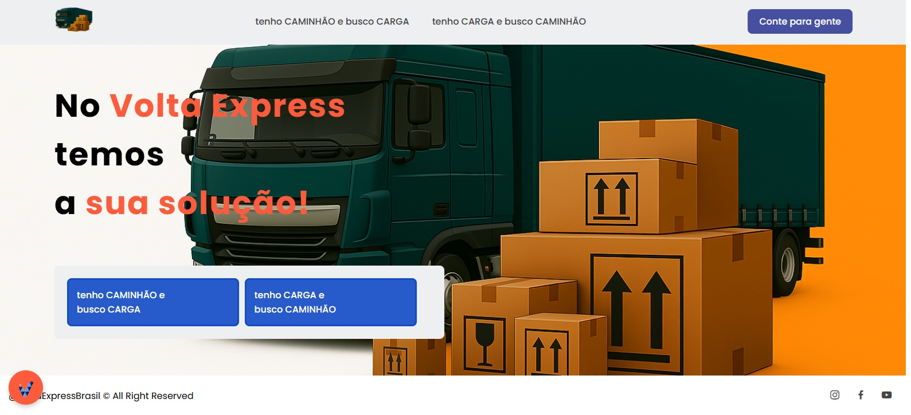

#### Menu

- [x] Logo Personalizado
- [x] Opção 1 - tenho caminhão e busco carga
- [x] Opção 2 - tenho carga e busco caminhão
- [ ] Botão Conte para gente: fazer o formulário

#### Dobra Principal

- [x] Imagem principal
- [x] Lema da Startup
- [x] CTA 1 - tenho caminhão e busco carga
- [x] CTA 2 - tenho carga e busco caminhão
- [x] Botão Fixed para o Suporte Whatsapp

#### Footer

- [x] Mensagem Copyright
- [ ] Informações importantes e documentos de consulta
- [ ] Redes Sociais: Instagram - Uma trilha para a Startup: criar 10 postagens para cada modelo
- [ ] Redes Sociais: Facebook - Uma trilha para a Startup: criar 10 postagens para cada modelo
- [ ] Redes Sociais: Youtube - Uma trilha para a Startup: criar 10 postagens para cada modelo

### tenho caminhão e busco carga

Página da persona CAMINHONEIRO, onde "tenho caminhão e busco carga". 
Aqui o objetivo é visualizar cargas e anunciar viagens.

- 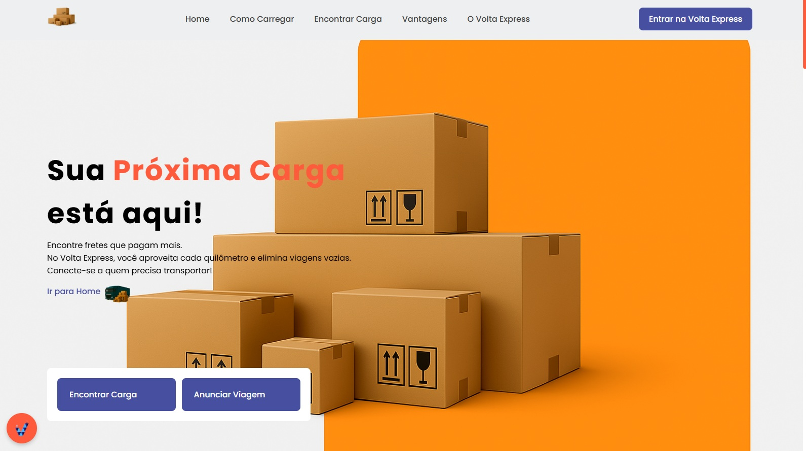

#### Menu

- [x] URL: http://127.0.0.1:5500/quero-carregar/index.html
- [x] Logo Personalizado
- [x] Home
- [x] Como Carregar
- [x] Encontrar Carga
- [x] Vantagens
- [x] O Volta Express 
- [x] Botão Entrar na Volta Express
- [ ] Encontrar Carga: Inteligência de informações

#### Dobra Home 

- [x] Imagem principal
- [x] Lema da Startup para a Personal Caminhoneiro
- [x] CTA 1 - Encontrar Carga
- [x] CTA 2 - Anunciar Viagem
- [x] CTA 3 - Ir para a Home
- [x] Botão Fixed para o Suporte Whatsapp

#### Dobra Como Carregar 

- [x] Os passos principais e fundamentais para realizar o objetivo principal dessa persona
- [ ] Aperfeiçoar os passos
- [ ] Usar imagens reais do app aqui em uma galeria

- 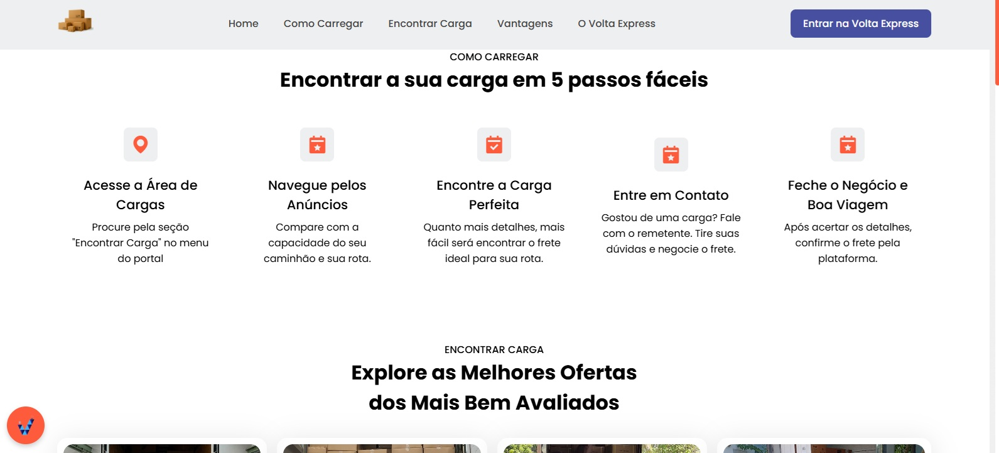

#### Dobra Encontrar Carga 

- [x] Visualizar as cargas para serem escolhidas
- [x] O design de cada card deve conter as informações que constam no formulario de anunciar carga da outra persona
- [ ] Encontrar Carga: Inteligência de informações

- 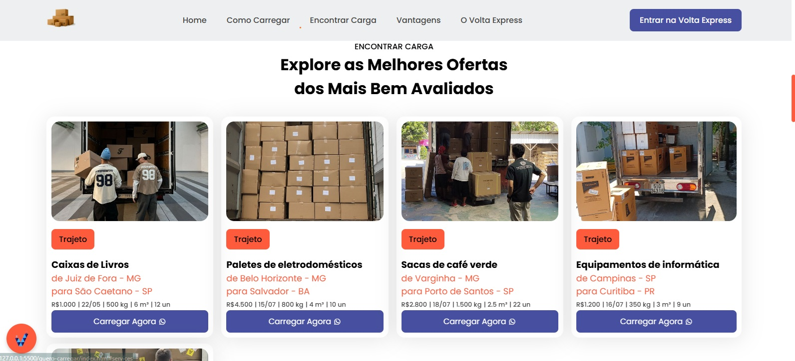

#### Dobra Vantagens

- [x] Os 4 problemas que a nossa solução resolve
- [ ] Aperfeiçoar as vantagens
- [ ] Usar imagens reais do app aqui em uma galeria

- 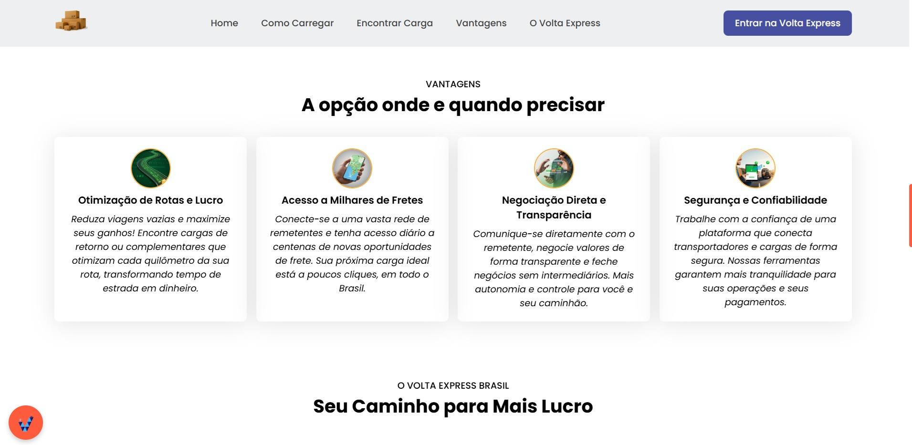

#### Dobra O Volta Express

- [x] A logo em destaque
- [x] A história da startup para a perspectiva da persona

- 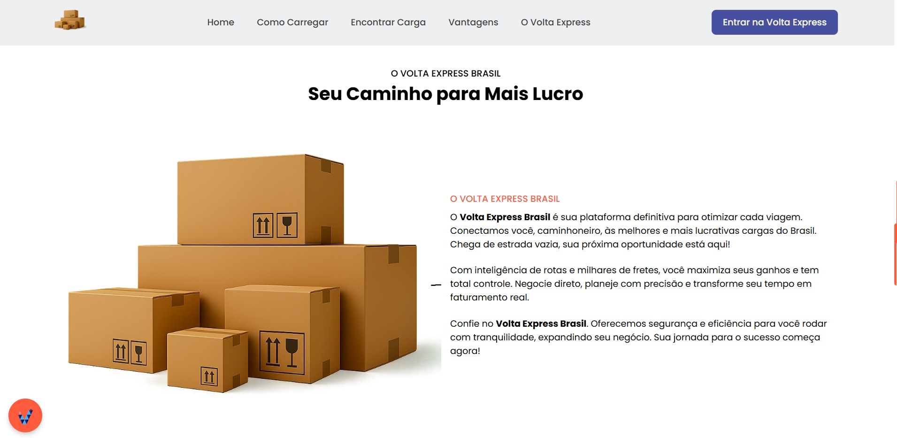

#### Dobra Newsletter

- [x] Cadastrar para enviar conteúdos de logistica 

- 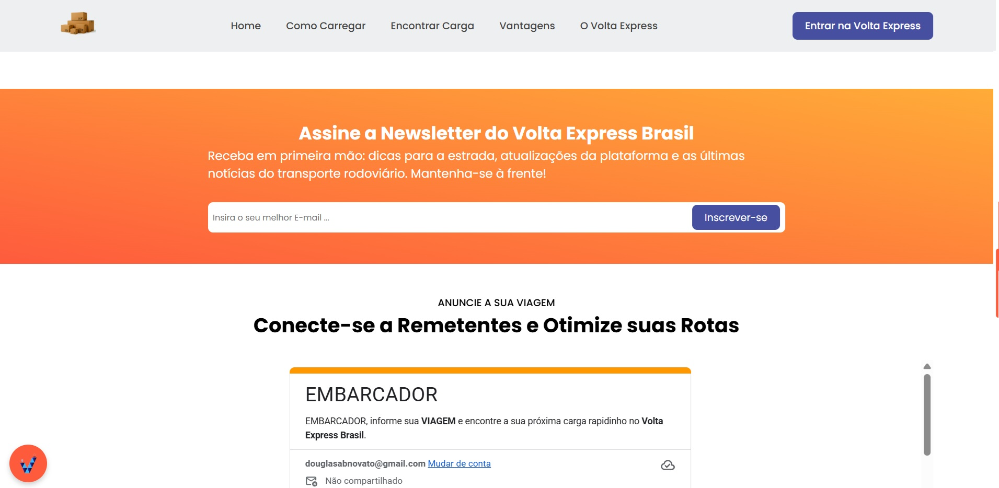

#### Dobra Anunciar a sua Viagem

- [x] Informações para o caminhoneiro anunciar viagem 

- 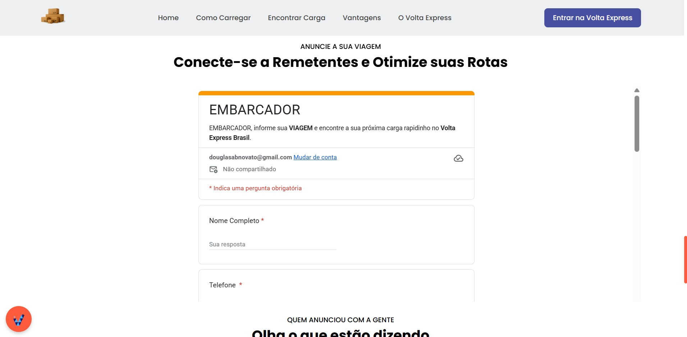

#### Dobra Quem anunciou com a gente

- [x] Depoimentos de clientes

- 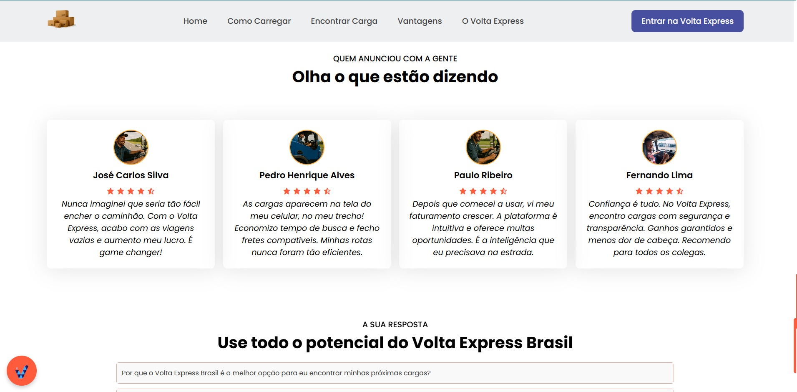

#### Dobra FAQ

- [x] Com o levantamento das perguntar nos canais de relacionamentos
- [x] Com o resultado dos QAs da equipe

- 

#### Dobra Footer

- [x] Mensagem Copyright
- [ ] Informações importantes e documentos de consulta
- [ ] Redes Sociais: Instagram - Uma trilha para Caminhoneiro: criar 10 postagens para cada modelo
- [ ] Redes Sociais: Facebook - Uma trilha para Caminhoneiro: criar 10 postagens para cada modelo
- [ ] Redes Sociais: Youtube - Uma trilha para Caminhoneiro: criar 10 postagens para cada modelo

- 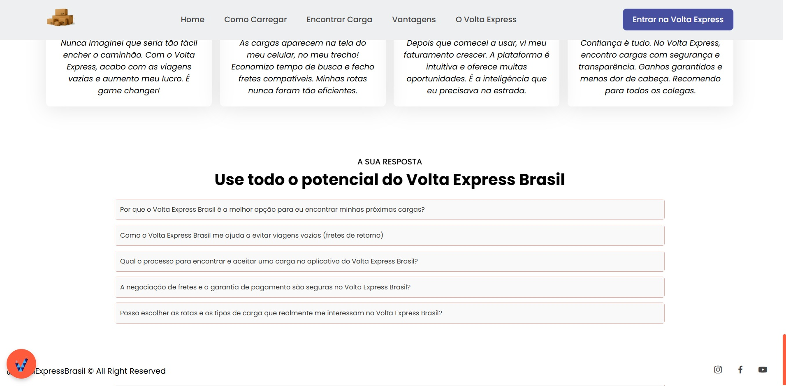

#### Login / Esqueci a senha / Register 

- [x] Login - Design
- [x] Login - Logo Personalizada
- [x] Login - Título e frase de efeito
- [x] Login - Informações
- [x] Login - Botão para Esqueceu sua senha
- [x] Login - Botão para Entrar
- [x] Login - Botão para Criar Conta
- [x] Login - Botão para Ir para Quero Carregar
- [ ] Login - Funcionalidade
- [ ] Login - Funcionalidade Esqueceu sua senha
- [x] Register - Informações
- [ ] Register - Funcionalidade

- 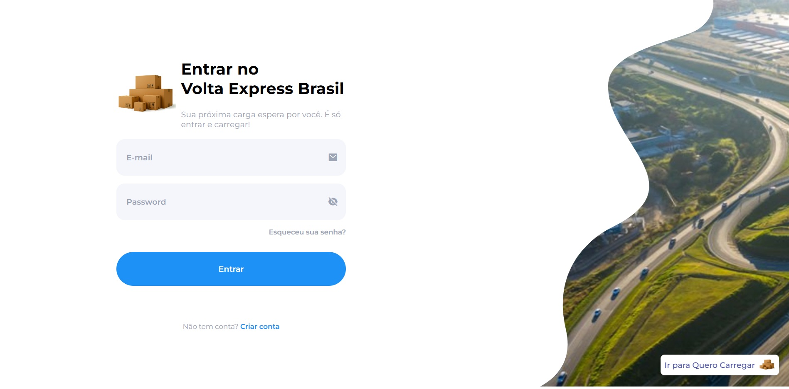
- 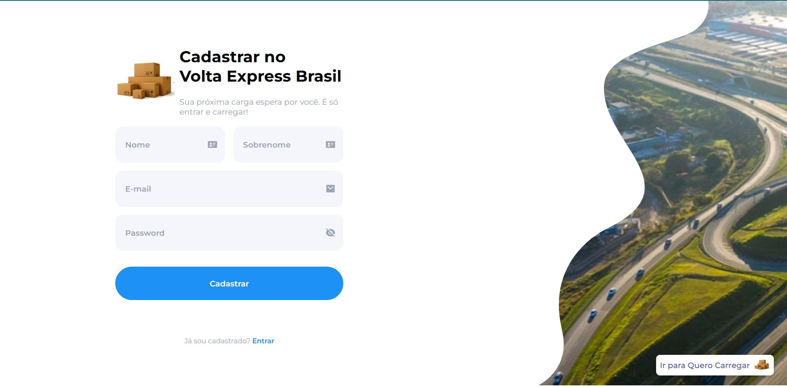

### tenho carga e busco caminhão

Página da persona EMBARCADOR, onde "tenho carga e busco caminhão". 
Aqui o objetivo é visualizar viagens e anunciar carga.

- 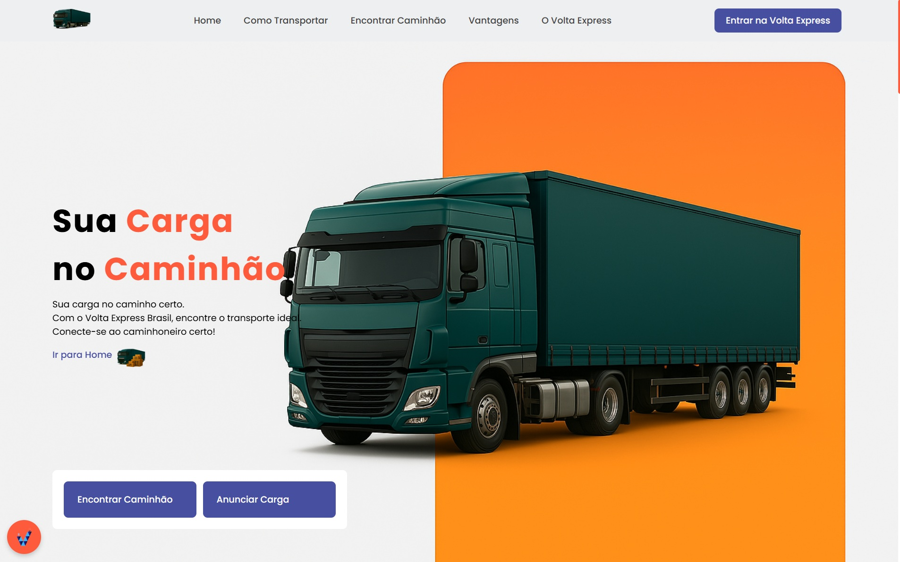

#### Menu

- [x] URL: http://127.0.0.1:5500/quero-transportar/index.html
- [x] Logo Personalizado
- [x] Home
- [x] Como Transportar
- [x] Encontrar Caminhão
- [x] Vantagens
- [x] O Volta Express 
- [x] Botão Entrar na Volta Express
- [ ] Encontrar Caminhão: Inteligência de informações

#### Dobra Home 

- [x] Imagem principal
- [x] Lema da Startup para a Personal Caminhoneiro
- [x] CTA 1 - Encontrar Caminhão
- [x] CTA 2 - Anunciar Carga
- [x] CTA 3 - Ir para a Home
- [x] Botão Fixed para o Suporte Whatsapp

#### Dobra Como Transportar 

- [x] Os passos principais e fundamentais para realizar o objetivo principal dessa persona
- [ ] Aperfeiçoar os passos
- [ ] Usar imagens reais do app aqui em uma galeria

- 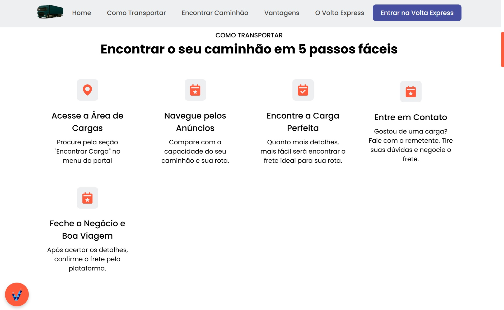

#### Dobra Encontrar Caminhão 

- [x] Visualizar as cargas para serem escolhidas
- [x] O design de cada card deve conter as informações que constam no formulario de anunciar carga da outra persona
- [ ] Encontrar Caminhão: Inteligência de informações

- 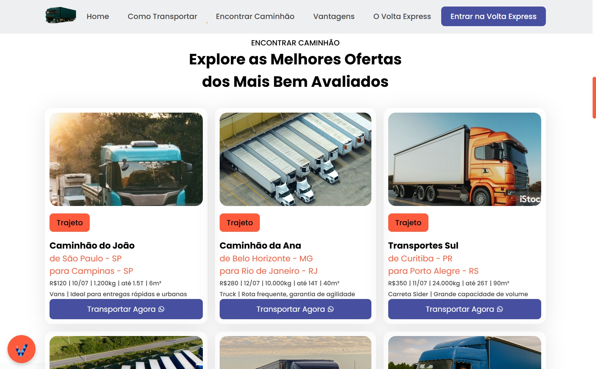

#### Dobra Vantagens

- [x] Os 4 problemas que a nossa solução resolve
- [ ] Aperfeiçoar as vantagens
- [ ] Usar imagens reais do app aqui em uma galeria

- 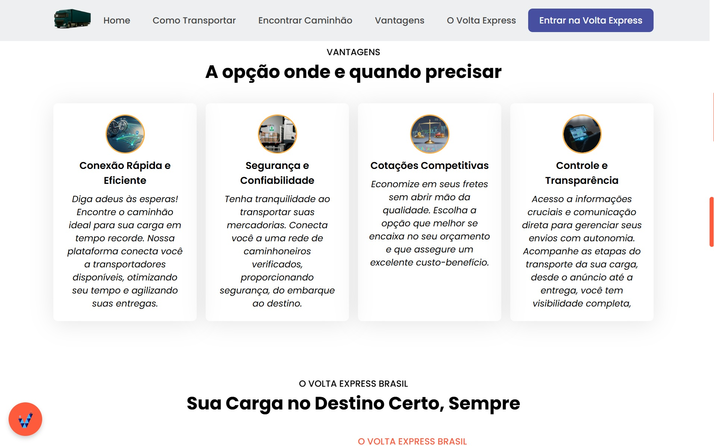

#### Dobra O Volta Express

- [x] A logo em destaque
- [x] A história da startup para a perspectiva da persona

- 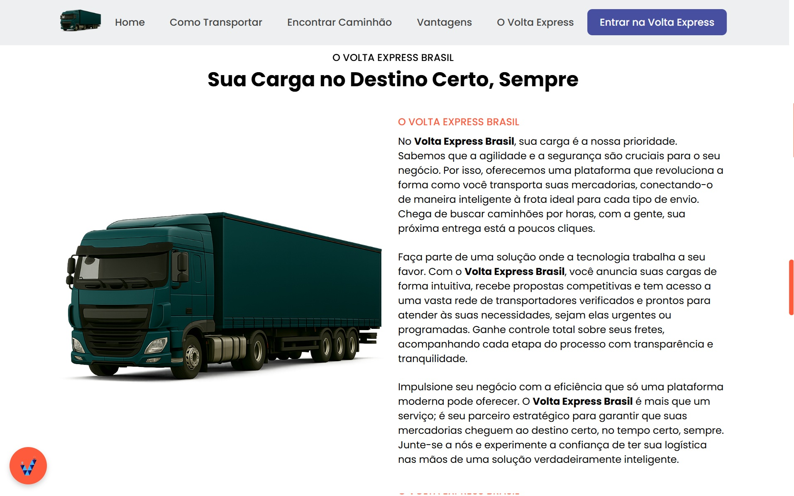

#### Dobra Newsletter

- [x] Cadastrar para enviar conteúdos de logistica 

- 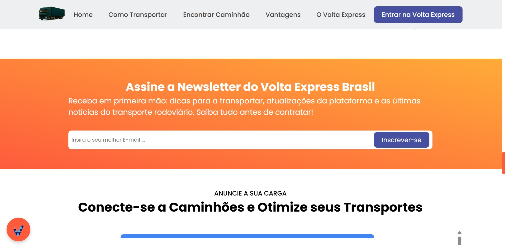

#### Dobra Anunciar a sua Viagem

- [x] Informações para o caminhoneiro anunciar viagem

- 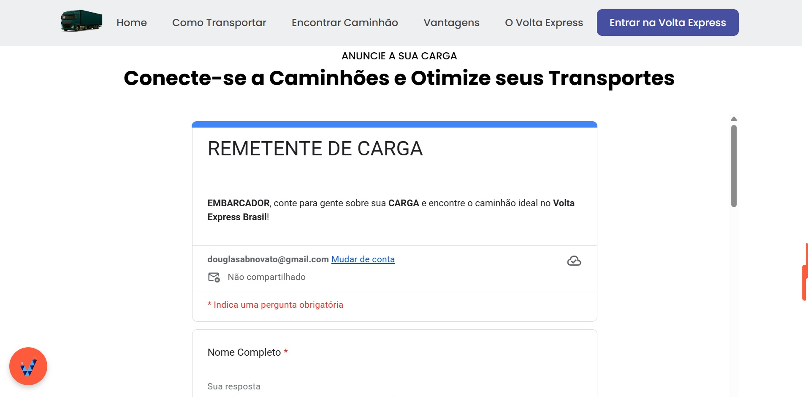

#### Dobra Quem anunciou com a gente

- [x] Depoimentos de clientes

- 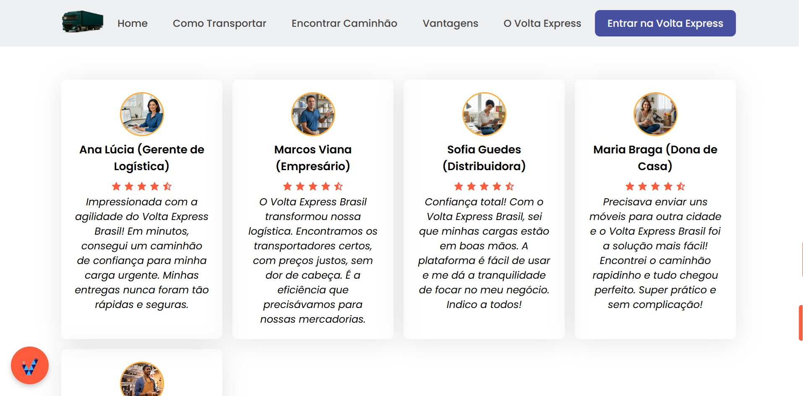

#### Dobra FAQ

- [x] Com o levantamento das perguntar nos canais de relacionamentos
- [x] Com o resultado dos QAs da equipe

- 

#### Dobra Footer

- [x] Mensagem Copyright
- [ ] Informações importantes e documentos de consulta
- [ ] Redes Sociais: Instagram - Uma trilha para Embarcador: criar 10 postagens para cada modelo
- [ ] Redes Sociais: Facebook - Uma trilha para Embarcador: criar 10 postagens para cada modelo
- [ ] Redes Sociais: Youtube - Uma trilha para Embarcador: criar 10 postagens para cada modelo

- 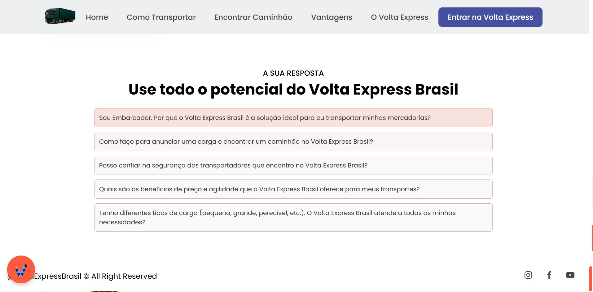

#### Login / Esqueci a senha / Register 

- [x] Login - Design
- [x] Login - Logo Personalizada
- [x] Login - Título e frase de efeito
- [x] Login - Informações
- [x] Login - Botão para Esqueceu sua senha
- [x] Login - Botão para Entrar
- [x] Login - Botão para Criar Conta
- [x] Login - Botão para Ir para Quero Carregar
- [ ] Login - Funcionalidade
- [ ] Login - Funcionalidade Esqueceu sua senha
- [x] Register - Informações
- [ ] Register - Funcionalidade

- 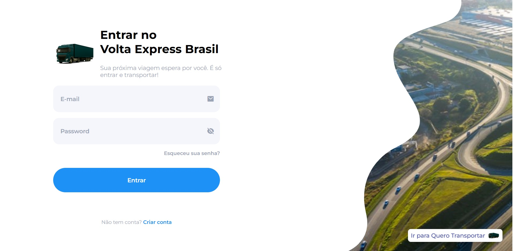
- 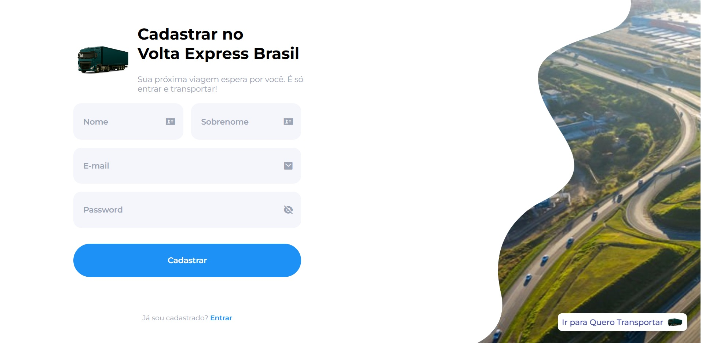

### Inteligência de Informações

#### encontrar carga

- Cada card tem as informações mais importantes para atrair o transportador a selecionar a sua carga.
- 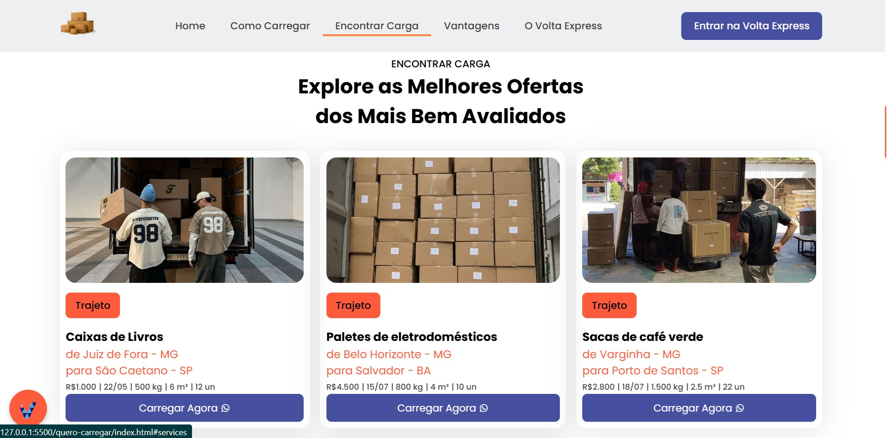

- Ao clicar no botão trajeto, exibe o mapa com as coordenadas
- 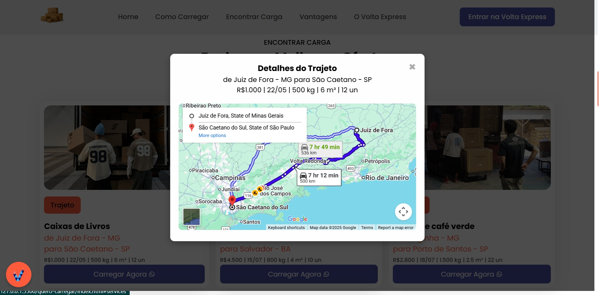

- [ ] fazer a exibição dessas informações de forma automática e sincronizada com a outra persona

#### encontrar caminhão

- Cada card tem as informações mais importantes para atrair o embarcador a selecionar a sua caminhao.
- 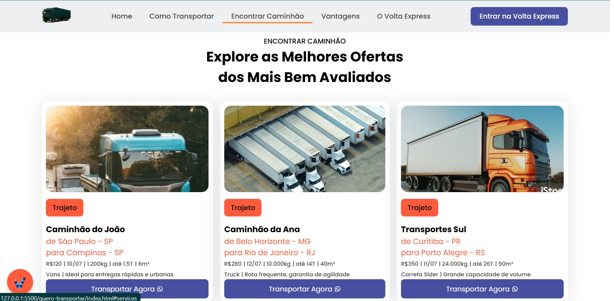

- Ao clicar no botão trajeto, exibe o mapa com as coordenadas
- 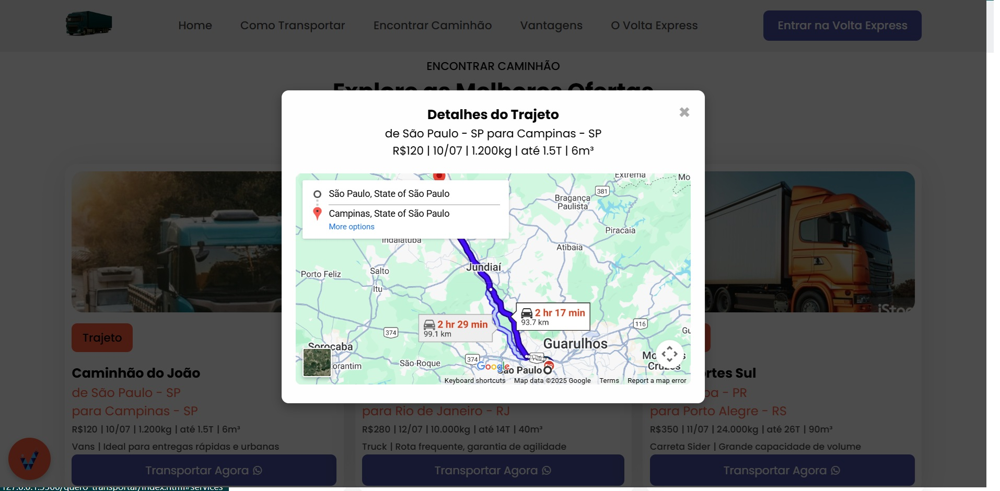

- [ ] fazer a exibição dessas informações de forma automática e sincronizada com a outra persona

## Versão 5 - developer-v5.2

## Personas

Apresentaremos as informações de forma seguimentada 

### Home

Será o principal ambiente de divulgação da marca Volta Express Brasil
Seguimentação: Transportador ou Embarcador

- [x] Ao abrir no Edge , com 100% do zoom ele corta a frase "Entrar no Volta Express Brasil" que fica no menu ancoragem de bloco azul
- [x] A frase: "No Volta Express Brasil temos a sua solução!" a parte de "sua solução" está apagado. Sugestão mesma cor do Volta Express Brasil
- [x] Melhorar as duas frases em caixa azul e clicáveis
      sugestão: Tenho Caminhão e Busco Carga / Tenho Carga e Busco Caminhão
- [x] Botão principal está abrindo nova janela e não deve abrir nova janela para que possamos analisar via Google Analytics
- [x] Footer: Ícones de redes sociais: facebook, instagram , youtube, twitter 
- [ ] Botão estilizado e com ícone do whatsapp
- [x] Foco de ação para o cliente
    - Qual o objetivo desse conteúdo?
    - Qual a objeção superada?
    - cta para levar para a lista ativa da ação principal
    - cta para permitir anunciar
- [ ] Home com o fluxo de login/logout:
    - Exibir o nome do usuário logado no header.
    - Trocar o botão "Conte para gente" por "Sair" quando tiver currentUser no localStorage.
    - Redirecionar automaticamente para login se o usuário não estiver logado. 

### Embarcador

A persona do Embarcador e tudo do ecossistema a partir do seu ponto de vista.
 
Tenho Caminhão e busco Carga
Quero Carregar

- [x] Trocar palavras em inglês para português
- [x] Melhor não ter no momento barra de pesquisa
- [x] No lugar de ter barra de pesquisa tem botão de CTA para levar para lista ativa e outro para levar para um formulário que o caminhoneiro anuncia sua disponibilidade de viagem (jotform)
- [x] Diminuir para 9 exposições de cargas
- [ ] Criar paginação dos anúncios para ir navegando para modo logado
- [ ] Mostrar nos cards o mapa, peso da carga, volume e data
- [ ] Desenvolver a funcionalidade de Newsletter
- [x] Desenvolver a funcionalidade de FAQ
- [x] Quando clicar em carregar agora, deve cair no whatsapp da pessoa que está anunciando
  - mensagem: Olá! Gostei do seu anúncio no Volta Express Brasil - Carregar Agora! Quero saber mais detalhes. : https://wa.me/5532998615190?text=Ol%C3%A1!%20Gostei%20do%20seu%20an%C3%BAncio%20no%20Volta%20Express%20Brasil%20-%20Carregar%20Agora!%20Quero%20saber%20mais%20detalhes. 
- [ ] Botão de whatsapp de cada card de anúncio com o número de contato do respectivo anúncio
- [ ] Cadastrar Embarcador
  - cadastrar, entrar, trocar senha
  - validações 
  - autenticação
  - id único que será a senha de acesso inicial
- Cadastro do Embarcador: <iframe src="https://docs.google.com/forms/d/e/1FAIpQLSdtUzKmapxQKWFjIaADxmI2nyOyvyELG0E9GFMkmQCvwBCfFg/viewform?embedded=true" width="640" height="1714" frameborder="0" marginheight="0" marginwidth="0">Carregando…</iframe> 
- Anúncio do Embarcador: <iframe src="https://docs.google.com/forms/d/e/1FAIpQLSdEERHf9DlfKV6ExlJWAqO2rkrEfiDm7j52nJ8QE3pMg809-g/viewform?embedded=true" width="640" height="2244" frameborder="0" marginheight="0" marginwidth="0">Carregando…</iframe> 
- [ ] Fluxo de Login e Register com alternativa conforme a persona
- [ ] Inicialmente, usar o form de cadastro, gerar a senhar, dar acesso com validação  
- [ ] Temos que criar depois uma página pós corrida, aonde o intuito é ter uma avaliação igual do bla bla car  
- [ ] Objeto - Users: [
- {
- "nome":"peaky",
- "sobrenome":"blinders",
- "email":"peakyblinders@dev.com.br",
- "password":"$developer1",
- "type":"transportador"
- },
- {
- "nome":"spider",
- "sobrenome":"man",
- "email":"spiderman@dev.com.br",
- "password":"$developer3",
- "type":"transportador"
- },
- {
- "nome":"Petrobras",
- "sobrenome":"Gasolina",
- "email":"petrobrasgasolina@dev.com.br",
- "password":"$developer4",
- "type":"transportador"
- },
- {
- "nome":"Palmeiras",
- "sobrenome":"Futebol",
- "email":"palmeirasfutebol@dev.com.br",
- "password":"$developer5",
- "type":"transportador"
- }
- ]
- [ ] Criar log de acesso
- [x] Botão back em login para volta a persona OFF
- [ ] URG: implementar a autenticação de usuário com firebase para registro, login, logout, esqueci senha com html, css, javascript.
- [x] Lista de anúncios OFF e ON: Primeira tarefa - Tenho uma lista de anúncios em quero carregar. Hoje tem 9 cards, quero fazer uma paginação, inicialmente com 5 itens sendo exibidos, para cada item avançado na paginação, exibir mais 6 itens.  Segunda tarefa - Depois de estruturar a paginação, quero que em modo off, deslogado, só exiba os 5 primeiros cards. A paginação só estará disponível para quando estiver logado.

### Transportador

A persona do Transportador e tudo do ecossistema a partir do seu ponto de vista.

Tenho Carga e busco Caminhão
Quero Transportar

- [x] Trocar palavras em inglês para português
- [x] Melhor não ter no momento barra de pesquisa
- [x] No lugar de ter barra de pesquisa tem botão de CPA para levar para lista ativa e outro para levar para um formulário que o remetente anuncia sua disponibilidade de carga (jotform)
- [x] Diminuir para 9 exposições de cargas
- [ ] Criar paginação dos anúncios para ir navegando para modo logado
- [ ] Mostrar nos cards o mapa, peso da carga, volume e data
- [ ] Desenvolver a funcionalidade de Newsletter
- [x] Desenvolver a funcionalidade de FAQ
- [x] Quando clicar em "transportar agora", deve cair no whatsapp da pessoa que está anunciando (link: https://wa.me/5532998615190)
  - mensagem: Olá! Gostei do seu anúncio no Volta Express Brasil - Transportar Agora! Quero saber mais detalhes. : https://wa.me/5532998615190?text=Ol%C3%A1!%20Gostei%20do%20seu%20an%C3%BAncio%20no%20Volta%20Express%20Brasil%20-%20Transportar%20Agora!%20Quero%20saber%20mais%20detalhes.
- [ ] Botão de whatsapp de cada card de anúncio com o número de contato do respectivo anúncio
- [ ] Cadastrar Transportador
  - cadastrar, entrar, trocar senha
  - validações 
  - autenticação
  - id único que será a senha de acesso inicial 
- Cadastro do Transportador: <iframe src="https://docs.google.com/forms/d/e/1FAIpQLSft9tp8rgdYr8ZQ3-QJlUcNulJa1GfDmeSsezeH1joUDah5uQ/viewform?embedded=true" width="700" height="520" frameborder="0" marginheight="0" marginwidth="0">Carregando…</iframe>
- Anúncio do Transportador: <iframe src="https://docs.google.com/forms/d/e/1FAIpQLSeFjrVBNm2cwfAl7l9CuvAyxEHsomHJIF6AvvLOX7YygpbinA/viewform?embedded=true" width="640" height="2295" frameborder="0" marginheight="0" marginwidth="0">Carregando…</iframe>  
- [ ] Fluxo de Login e Register com alternativa conforme a persona
- [ ] Inicialmente, usar o form de cadastro, gerar a senhar, dar acesso com validação  
- [ ] Temos que criar depois uma página pós corrida, aonde o intuito é ter uma avaliação igual do bla bla car

### 📁 Estrutura de Pastas

````markdown
VOLTA-EXPRESS-BRASIL/
├── .github/              # Configurações do GitHub (workflows, templates)
├── assets/               # Assets globais (ainda não totalmente centralizados)
├── public/               # Arquivos públicos globais (favicon, manifest, etc.)
├── quero-carregar/      # 🚛 MÓDULO: QUERO CARREGAR (Embarcador - busca caminhão)
│   ├── assets/           # Assets e estilos internos
│   │   ├── login-register/
│   │   │   ├── assets/
│   │   │   │   ├── css/
│   │   │   │   │   └── styles.css
│   │   │   │   ├── img/
│   │   │   │   ├── js/
│   │   │   │   │   └── main.js
│   │   │   │   └── scss/
│   │   ├── public/
│   │   │   └── index.html # Tela de Login/Cadastro do Embarcador
│   └── public/
│       └── index.html    # Dashboard/Tela principal do Embarcador
│
├── quero-transportar/   # 📦 MÓDULO: QUERO TRANSPORTAR (Transportador - busca carga)
│   ├── assets/
│   ├── login-register/
│   │   └── public/
│   │       └── index.html # Tela de Login/Cadastro do Transportador
│   └── index.html        # Dashboard/Tela principal do Transportador
│
├── index.html            # Landing page principal
├── script.js             # Script global/experimental (verificar uso)
├── style.css             # Estilos globais/experimentais (verificar uso)
└── README.md
````

## ROADMAP

### google meu negócio

- configurar atributos para gerar informações

### redes socias

- analisar quais perfis são estratégicos
- criar perfis
- criar, validar conteúdos
- agendar e compartilhar conteúdo

### Comunicação

#### E-mail especializados:

  - financeiro@voltaexpressbrasil.com 
  - juridico@voltaexpressbrasil.com 
  - cs@voltaexpressbrasil.com 
  - suporte@voltaexpressbrasil.com 
  - marketing@voltaexpressbrasil.com 
  - vendas@voltaexpressbrasil.com 

#### Whatsapp

  - alterar o nome e ícone no whatsapp para Volta Express Brasil
      - [ ] Volta Express Brasil : suporte (Novo contato (COMPRAR PRÉ PAGO))
      - [ ] Volta Express Brasil | Equipe : equipe Volta Express

### Suporte

- [ ] whatsapp de suporte:
  - mensagem do botão do whatsapp
    - Olá! Gostei do seu anúncio no Volta Express Brasil - Carregar Agora! Quero saber mais detalhes.
    https://wa.me/5532998615190?text=Ol%C3%A1!%20Gostei%20do%20seu%20an%C3%BAncio%20no%20Volta%20Express%20Brasil%20-%20Carregar%20Agora!%20Quero%20saber%20mais%20detalhes.  
    - Olá! Gostei do seu anúncio no Volta Express Brasil - Transportar Agora! Quero saber mais detalhes.
    https://wa.me/5532998615190?text=Ol%C3%A1!%20Gostei%20do%20seu%20an%C3%BAncio%20no%20Volta%20Express%20Brasil%20-%20Carregar%20Agora!%20Quero%20saber%20mais%20detalhes.  

### Chat e IA

Treinar o agente de IA, Claudinei, para interagir com os usuários e aperfeiçoar as informações do cenário de logística.

## QA

Desenhar os testes

### Geral

- [x] Favicon personalizado: home, transportador, embarcador
- [x] Quero Transportar - Favicon: aumentar tamanho
- [x] Quero Transportar - Logo: aumentar tamanho

### DevOps

- [x] fazer o domínio com volta express brasil: https://douglasabnovato.github.io/volta-express-brasil/ 
  
### Descontinuar tarefa:

#### Jotform (Descontinuada)

*Motivo*: optamos por usar o google form 

Plataforma de solução para capturar informações.
Cada formulário com seus atributos e seus respectivos objetivos.

- Após enviar, deve mostar que foi enviado para análise.
- Implementar: https://www.jotform.com/help/597-how-to-get-google-maps-api-key-for-jotform-mapping-widgets/
- Implementar: https://jotmap.jotform.io/
- Testar Show Map Location : Para verificar se vai puxar a latitude e longitude da origem e destino do anunciante
- Aperfeiçoar Design do Jotform

- Anunciar carga:

```html
<iframe
  id="JotFormIFrame-250908223798668"
  title="Detalhes Viagem"
  onload="window.parent.scrollTo(0,0)"
  allowtransparency="true"
  allow="geolocation; microphone; camera; fullscreen; payment"
  src="https://form.jotform.com/250908223798668"
  frameborder="0"
  style="min-width: 100%; max-width: 100%; height: 539px; border: none"
  scrolling="no"
>
</iframe>
<script src="https://cdn.jotfor.ms/s/umd/latest/for-form-embed-handler.js"></script>
<script>
  window.jotformEmbedHandler(
    "iframe[id='JotFormIFrame-250908223798668']",
    "https://form.jotform.com/"
  );
</script>
```

- Anunciar viagem:

```html
<iframe
  id="JotFormIFrame-250906267526057"
  title="Anunciar Viagem do Caminhão"
  onload="window.parent.scrollTo(0,0)"
  allowtransparency="true"
  allow="geolocation; microphone; camera; fullscreen; payment"
  src="https://form.jotform.com/250906267526057"
  frameborder="0"
  style="min-width: 100%; max-width: 100%; height: 539px; border: none"
  scrolling="no"
>
</iframe>
<script src="https://cdn.jotfor.ms/s/umd/latest/for-form-embed-handler.js"></script>
<script>
  window.jotformEmbedHandler(
    "iframe[id='JotFormIFrame-250906267526057']",
    "https://form.jotform.com/"
  );
</script>
```

# Volta Express V4

Um projeto de inteligência em logística e interação.

Um preview das últimas versões, 3 e 4, do projeto pois são importantes fluxos.

## versão 4.0 - Volta Express

- 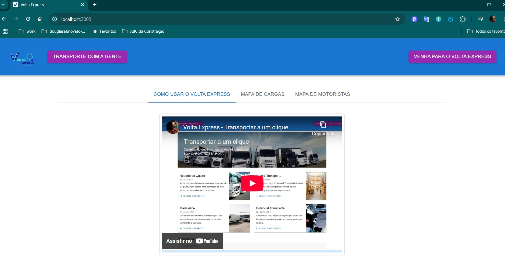

- 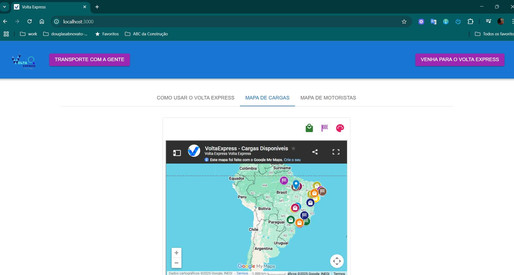

- 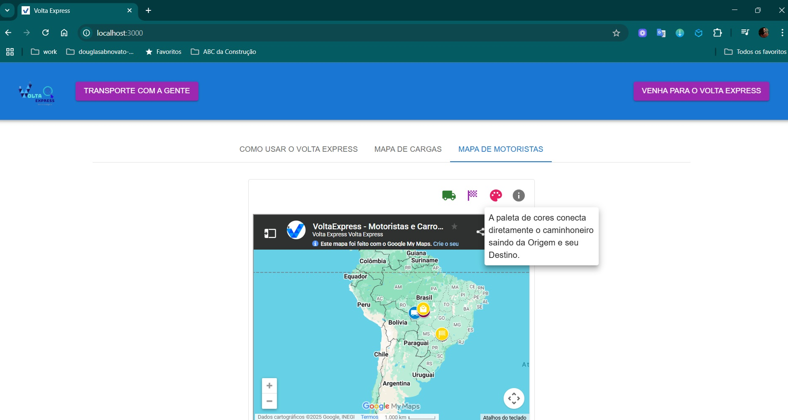

- 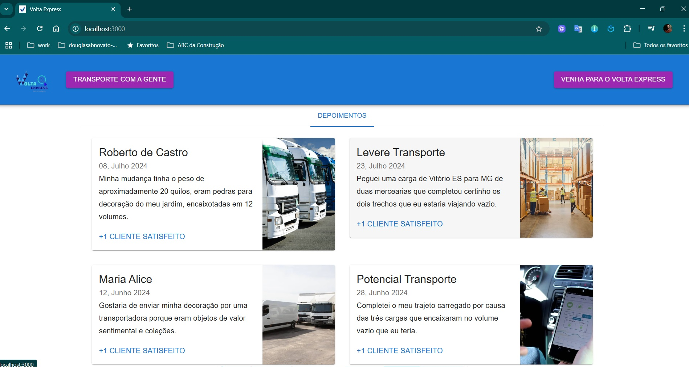

- 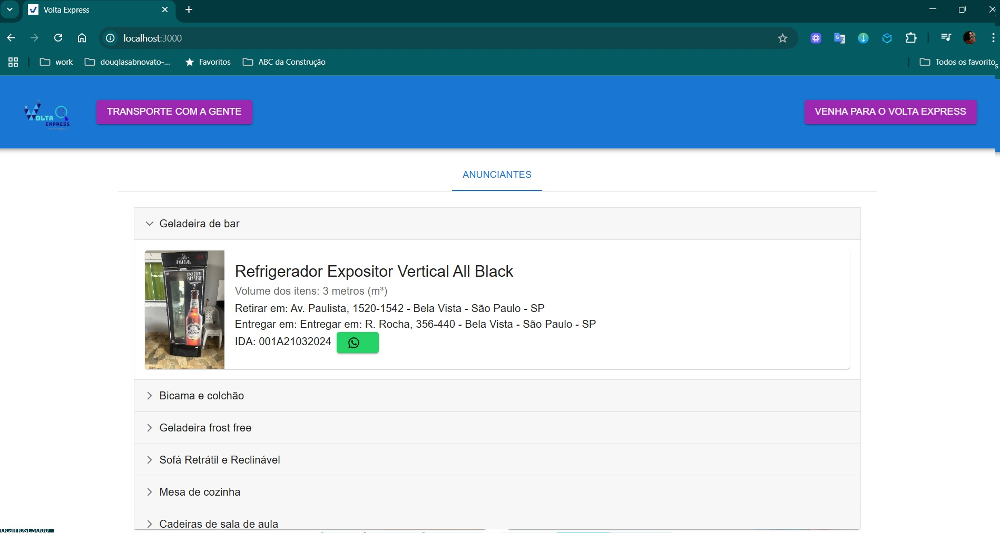

- 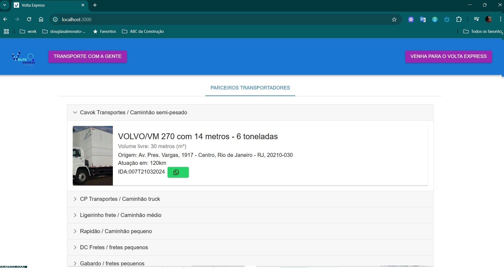

- 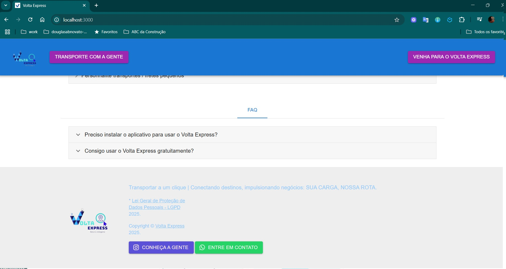

## versão 3.0 - Volta Express

- 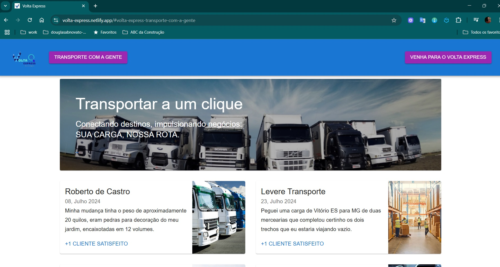

- 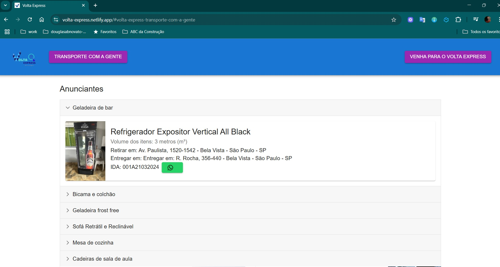

- 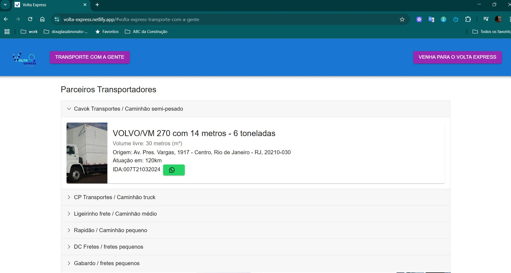

- 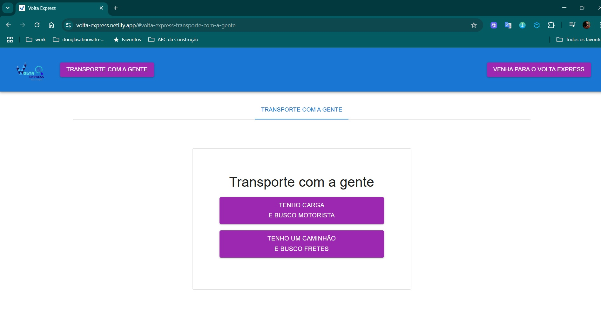

- 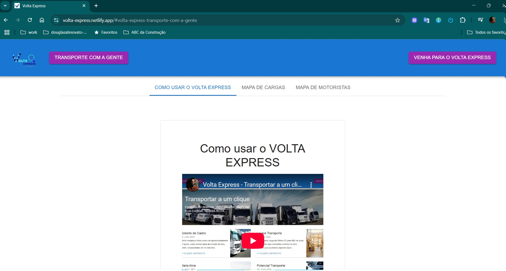

- 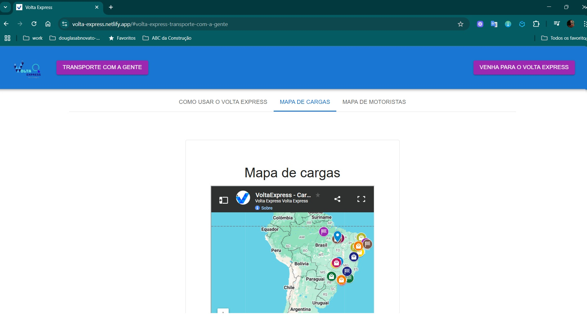

- 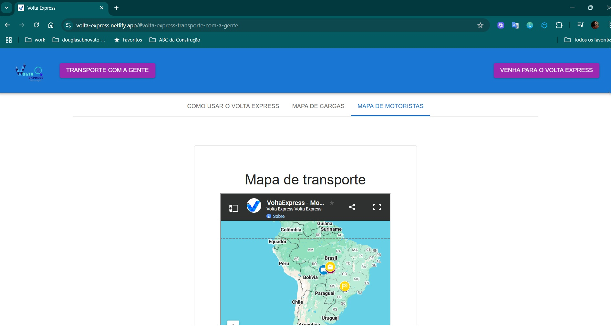

- 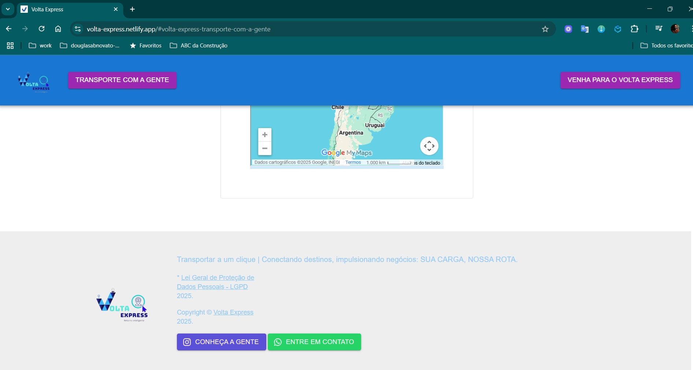

### Detalhes de Projetos

- Foco da plataforma é atrair a atenção de usuário
- Atração são funcionalidades e serviços que solucionam problemas dos clientes do nosso ecossistema
- Incluir o design do Google Maps para dentro da aplicação
- Analisar ciclo de vida dos usuários da plataforma.
- Cérebro: automação da interação das informações dos clientes
- DESAFIO: realizar mais viagens

### Gerais

- [x] Nossa equipe de suporte atende no whatsapp, 5532998615190
- [x] Forms para interação com clientes
  - [x] Formulários no domínio volta
  - [x] ter forms reservas
  - [x] permissão dos forms
  - [x] aperfeiçoar o copy dos formulários
- [x] Warnings: correções para hospedagem no servidor

### Seções em ordem com objetivo estratégico

- header
- como usar o volta express / mapa de cargas / mapa de motoristas
- banner
- transporte com a gente
- depoimentos
- anunciantes
- parceiros transportadores
- footer

### Portal MVP

- [x] Botão de contato: Número Whatsapp
- [x] Mobile: tres botões no hamburguer
- [x] Legenda: inserir uma legenda para os mapas (versão v4)
- [ ] Componente rect com google maps
- [ ] Novo form inteligente
  - [ ] Simples: para quem está querendo transportar a carga
    - [ ] origem
    - [ ] destino
    - [ ] data opcional (sumir quando chegar a data)
    - [ ] observações
    - [ ] contatos
  - [ ] Avançado: para caminhoneiro.
    - [ ] primeira pergunta:se a pessoa está em transito ou está aguardando
      - [ ] em trânsito
        - [ ] origem
        - [ ] destino
        - [ ] tipo de caminhao
        - [ ] contato
        - [ ] observações
      - [ ] está aguardando
        - [ ] origem
        - [ ] tipo de caminhão
        - [ ] contato
        - [ ] observações

### Marketing Digital

- [ ] Seção institucional Sobre
  - [ ] vídeo
  - [ ] membros da equipe
  - [ ] texto explicativo
- [ ] Seção Como usar
  - [ ] Vídeo com demonstração como usar as funcionalidades
    - [ ] dimensionar para mobile
    - [ ] Ferramentas usadas para gerar: wondershare filmora 14, obs studio, veed.io
  - [ ] Vídeo com montagem digital, self em ambiente de fundo
  - [ ] Texto explicativo com Imagem real de motorista, de anunciantes, de transportadoras
- [ ] Seção de Planos: opções das ofertas comerciais
- [ ] Copy: adicionar mais elementos
- [ ] Copy: aperfeiçoar o storytelling

### Redes Sociais

- [ ] Redes sociais Volta Express:
  - [x] [Instagram](https://www.instagram.com/voltaexpressbrasil): @voltaexpressbrasil
  - [ ] Facebook
  - [ ] Youtube: vídeos institucionais
  - [ ] Whatsapp

### Outbound para redes sociais

- [ ] Instagram / Facebook
  - [ ] Stories
  - [ ] Feeds
  - [ ] Vídeos Curtos
- [ ] Youtube
  - [ ] Vídeos Institucionais
- [ ] Whatsapp
  - [ ] Campanhas para aquecer os Leads
- [ ] Roadmap de disparos
- [ ] Roadmap de postagens

### Google Maps

- [x] mapa do geocode
- [x] adicionar os 2 mapas em abas conforme foco no clientDe
- [x] responsividade
- [x] abertura do mapa com mais zoom: Mundi, Brasil, Juiz de Fora
- [ ] Rota em destaque: cor no mapa
- [ ] Rota em texto: ordem das ruas
- [ ] Filtrar por palavra no mapa (autocomplete) - palavras chaves
- [ ] Estilizar os cards de informação
- [ ] Problema: "Nenhuma pessoa me contactou!": personalizar a mensagem do card.
- [ ] Destacar a rota ao clicar em um ícone da rota na origem ou no destino

#### Dados do marketing

- [ ] Saber que os anúncios funcionaram.
  - [ ] Funcionar significa que o transporte aconteceu por causa do _Volta Express_
- [ ] Google Ads
  - [ ] configurar na plataforma e capturar
  - [ ] entender as informações dos acessos com o Link em relatório
  - [ ] aperfeiçoar interações

### Relacionamento com os clientes

- [x] Whatsapp: botão de whatsapp para conversa
- [o] Seção feeback: espaço para OUVIR as pessoas para melhor direcionar (modelo newsletter)
- [x] Seção FAQ : 2 perguntas e respostas para esclarecimentos

#### Whatsapp

- [ ] ChatBot com a api do whatsapp para atendimento inteligente

### Processos

- Fluxo de Trabalho
- Fluxo de Operação
- Gestão de Negócio
- Gestão de Desenvolvimento
  - Branches do workflow: main, dev-volta-express-v4, volta-express-v4

#### TO-DO 19-11-2024

- [ ] atualizar informações do site - mergh
- [ ] atualizar to do no kaban teams - mergh
- [ ] subir funcionalidades no portal - novato
  - [x] legenda nos mapas
  - [x] transporte com a gente: ajustes de ux
  - [ ] atualizar vídeo

#### TO-DO 24-11-2024

- [ ] criar um form integrado a um bd que atualiza o mapa automaticamente - mergh
- [ ] o banco de dados sql - torres
- [ ] fazer a integração, forms, excel - torres e mergh

# Volta Express V3

- Focar no preenchimento dos formulários para permitir abordagens e anúncios dos stakeholders.

### Evoluções

- [x] Rodapé: Link para o documento oficial da LGPD
- [x] Rodapé: Botão de contato com Número Whatsapp

### Copies

- Os botões com textos com ordens das funcionalidades
- Os cards com textos atrativos para conversão

### Whatsapp e o suporte

- um botão de whatsapp nos anúncios com o número oficial

# Volta Express V2

O objetivo dessa aplicação é permitir anunciantes encontrarem parceiros transportadores para realizar seus transportes de mercadorias.

Também é nosso objetivo reduzir a zero o transporte a vazio dos veículos.

### Informações

- projeto nascido como Ferrex
- gestão do projeto detalhado no trello
- desenhar as regras de negócios no fluxo da aplicação
- esclarecer as funcionalidades
- esclarecer as tarefas de design
- validar novas funcionalidades
- desenvolver novas funcionalidades
- atualizar o mvp em produção

### Organização do projeto

- Componente da Página: Blog
- Componente da AppBar: Header
- Componente do Banner Principal: MainFeaturedPost
- Componente de Depoimentos: FeaturedPost
- Componentes dos Formulários: Blog
- Componente do Transporte com a gente: Checkout
- Componente do Rodapé: Footer

### Itens dos Formulários

- Formulário para Cadastrar
- Formulário do Anunciante
- Formulário do Parceiro Transportador

### Identidade Visual

As cores da aplicação em hexadecimal

Implementado o login e register no quero carregar com JSON.

## Versão 5

Implementado o login e register no quero carregar com localStorage

Versão 1 em 4 de set. de 2025, 00:24

Código de implantação
AKfycbwaoXveoPTeJ68083fJmsmR4luJdI8Kz1sDrsU2XffJpnVJrceswj2joWZs306XU-TJ

App da Web
https://script.google.com/macros/s/AKfycbwaoXveoPTeJ68083fJmsmR4luJdI8Kz1sDrsU2XffJpnVJrceswj2joWZs306XU-TJ/exec

Biblioteca
https://script.google.com/macros/library/d/1PkQcl2mjWhTq14tbX_q5jNY-HapM1_nlILPKC0YORoleOqQEeEmAB3Hw/1